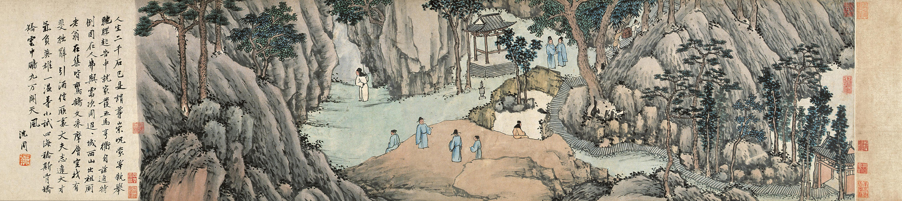

# Mid-Autumn, Tiger Hill, Late Ming

Amid self-imposed exile and pitifully reduced circumstances, as he prepared to awaken (as he put it) from the great dream of life, the 17th-century epicure, failson, and memoirist Zhang Dai 張岱 (1597-1684) wrote _Dream-Memories_ (陶庵夢憶 _Tao’an mengyi_), a collection of short vignettes recalling the dream-like days of wealth and privilege that had ended with the fall of the Ming in 1644. I’ve been translating these lately, as a spare-time sanity-maintenance project, and thought I would share Zhang’s description of the annual Mid-Autumn Night singing competition on Tiger Hill in Suzhou.

Happy Mid-Autumn! May there be as many or as few yolks as you prefer in your mooncakes, and may none of them have 五仁 filling.

* * *

 Shen Zhou 沈周, “A Farewell on Tiger Hill” (虎丘餞別圖)

On the fifteenth day of the eighth month they came to Tiger Hill: locals and visitors; scholar-officials with families in tow; chanteuses and accompanists; courtesans, actresses, and other belles of the demimonde; commoner wives and respectable daughters; hustlers and prettyboys; rakehells and wastrels; idlers and spongers; serving boys and confidence men, all packed together like scales on a fish. They laid out mats anywhere they could find a place to sit: on the stone ledge where Daosheng preached the Dharma so movingly that even the pebbles nodded, or on Thousand-Man Rock beneath it; between Crane Brook and Sword Pond; in front of the shrine to Grand Secretary Shen and even all the way to the Swordcleft Stone and past the first and second temple gates. From above, the crowds looked like geese flocking on a sandbar, or sunset clouds gathering over a river. The sky darkened, the moon rose, and from a hundred different spots rose a clamor of pipes and percussion, clashing cymbal ensembles and a thundering Yuyang drumbeat that shook earth and sky and drowned out even the loudest shouts.

With the first night watch this gave way to strings, flutes, and singers performing ensemble pieces like “Unfurl the Brocade Sails” and “Across the Limpid Lake.” Amid the confusion of cymbals and citterns and pipes and voices it was impossible to pick out a rhythm or tell one piece from another. As the night wore on, the crowds began gradually to disperse. The scholar-officials took to their pleasure-boats with their families, and the people who remained set about trying to out-sing one another, showing off in a farrago of Southern and Northern styles to the accompaniment by turns of woodwinds and strings. By now, it had become possible to make out the words, and the connoisseurs in attendance offered their appraisals of each line as it was sung.

By the second watch the crowds had quieted and all the instruments fallen silent save for one wisp of flute, clear and plaintive, that wound around the voices of the three or four remaining singers.

By the third watch, the moon hung alone in the sky, a chill had come into the air, and everyone was perfectly silent, even the mosquitoes. A lone figure strode out onto a rock high above, sat down, and sang, unaccompanied by flute or clapper, in a voice as fine as silk thread that rose and fell but never wavered, powerful enough to split stones and pierce clouds, every word as clear as a carving. The listeners sat transfixed, listening raptly to every subtle modulation of his voice. Nobody dared clap along. The hundred-odd people who sat there like stranded geese could only nod their heads in mute approval. Where but Suzhou could you find such connoisseurs!

 Mooncake-eating competition, Philadelphia Chinatown, 2024